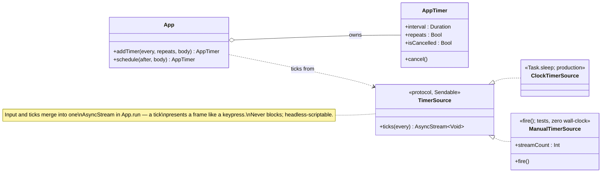
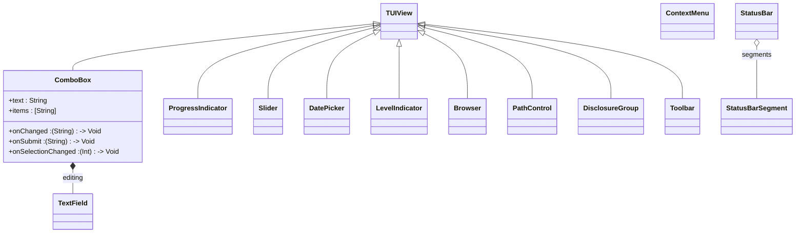

# TUIKit Controls — UML Class Diagram

A maintained class diagram of the control layer. Update it in the same commit
as any control change (new control, new public member, new event, changed
base relationship). The diagram is Mermaid, so it renders on GitHub and in
most Markdown viewers.

Conventions:

- Only the public/framework-facing surface is shown (interaction internals
  are omitted).
- Event callbacks are listed as fields typed as closures (e.g.
  `onActivate : () -> Void`).
- `«control»` in a note marks views intended as user-facing controls, versus
  structural views (`TUIView`, `StackView`, `Window`).

## Diagram

```mermaid
classDiagram
    direction TB

    class TUIView {
        <<@MainActor, base>>
        +frame : Rect
        +bounds : Rect
        +subviews : [TUIView]
        +isHidden : Bool
        +anchors : AnchorSet?
        +theme : Theme?
        +identifier : String?
        +styleClasses : Set~String~
        +styleSheet : StyleSheet?
        +effectiveTheme : Theme
        +intrinsicContentSize : Size?
        +minimumSize : Size
        +maximumSize : Size?
        +acceptsFirstResponder : Bool
        +isFirstResponder : Bool
        +addSubview(TUIView)
        +draw(Painter)
        +layoutSubviews()
        +relayout()
        +refresh()
        +keyDown(KeyInput) Bool
        +handleHotKey(KeyInput) Bool
        +handleColdKey(KeyInput) Bool
        +mouseEvent(MouseInput) Bool
        +hitTest(Point)
    }

    class Label {
        +text : String
        +style : CellStyle
        +alignment : TextAlignment
    }

    class ControlStyle {
        <<enum>>
        tinted
        bordered
    }

    class Button {
        +title : String
        +style : ControlStyle
        +onActivate : () -> Void
        +isPressed : Bool
        +activate()
    }

    class TextField {
        +text : String
        +placeholder : String
        +onChanged : (String) -> Void
        +onSubmit : (String) -> Void
        +setText(String)
    }

    class Checkbox {
        +label : String
        +isChecked : Bool
        +onChange : (Bool) -> Void
        +toggle()
        +setChecked(Bool, notify)
    }

    class RadioGroup {
        +options : [String]
        +selectedIndex : Int?
        +onSelectionChanged : (Int) -> Void
        +select(Int, notify)
    }

    class ListView {
        +items : [String]
        +selectedIndex : Int?
        +scrollOffset : Int
        +onSelectionChanged : (Int?) -> Void
        +onActivate : (Int) -> Void
        +select(Int?, notify)
    }

    class SegmentedControl {
        +segments : [String]
        +selectedIndex : Int?
        +onSelectionChanged : (Int) -> Void
        +select(Int, notify)
    }

    class TabView {
        +selectedIndex : Int
        +tabCount : Int
        +tabBarHeight : Int
        +onSelectionChanged : (Int) -> Void
        +addTab(String, content : TUIView)
        +select(Int, notify)
        +title(at : Int) String?
    }

    class ScrollView {
        +documentView : TUIView?
        +contentOffset : Point
        +contentSize : Size
        +showsIndicators : Bool
        +onOffsetChanged : (Point) -> Void
        +setOffset(Point, notify)
    }

    class Stepper {
        +value : Int
        +range : ClosedRange~Int~
        +step : Int
        +onValueChanged : (Int) -> Void
        +setValue(Int, notify)
        +stepValue(Int)
    }

    class TableColumn {
        <<struct>>
        +title : String
        +width : Width (fixed/flexible)
    }

    class TableView {
        +columns : [TableColumn]
        +rows : [[String]]
        +selectedIndex : Int?
        +onSelectionChanged : (Int?) -> Void
        +onActivate : (Int) -> Void
        +onSortRequested : (Int) -> Void
        +select(Int?, notify)
    }

    class TreeNode {
        +title : String
        +children : [TreeNode]
        +parent : TreeNode?
        +isExpanded : Bool
        +isExpandable : Bool
        +representedValue : Any?
        +addChild(TreeNode)
    }

    class FileSystemProvider {
        <<protocol>>
        +entries(at path) [FileSystemEntry]
    }

    class DirectoryTree {
        +rootPath : String
        +showsFiles : Bool
        +selectedPath : String?
        +selectedPathIsDirectory : Bool?
        +onSelectionChanged : (String?) -> Void
        +onActivate : (String) -> Void
        +setRoot(String)
        +reload()
        +expandRoot()
    }

    class Panel {
        +title : String
        +showsCloseButton : Bool
        +content : TUIView
        +onClose : () -> Void
    }

    class Dialog {
        +body : TUIView
        +buttons : [Button]
        +defaultButton : Button?
        +cancelButton : Button?
        +onDismiss : () -> Void
        +preferredSize : Size
        +addButton(title, isDefault, isCancel, action) Button
        +sizeToFit(in : Size)
    }

    class FileDialog {
        +mode : Mode (open/save/selectFolder)
        +chosenPath : String
        +suggestedName : String
        +onConfirm : (String) -> Void
    }

    class SplitView {
        +axis : StackView.Axis
        +first : TUIView
        +second : TUIView
        +currentDividerPosition : Int
        +minimumFirstLength : Int
        +minimumSecondLength : Int
        +onDividerMoved : (Int) -> Void
        +setDividerPosition(Int, notify)
    }

    class TreeView {
        +roots : [TreeNode]
        +selectedNode : TreeNode?
        +onSelectionChanged : (TreeNode?) -> Void
        +onActivate : (TreeNode) -> Void
        +select(TreeNode?, notify)
        +expand(TreeNode)
        +collapse(TreeNode)
    }

    class MenuItem {
        +title : String
        +keyEquivalent : KeyInput?
        +isEnabled : Bool
        +isSeparator : Bool
        +action : () -> Void
        +separator()$ MenuItem
    }

    class Menu {
        +title : String
        +items : [MenuItem]
        +addItem(title, keyEquivalent, action) MenuItem
        +addSeparator()
    }

    class MenuBar {
        +menus : [Menu]
        +isMenuOpen : Bool
        +addMenu(Menu)
        +openMenu(at : Int)
        +closeMenu()
    }

    class ColorPicker {
        +color : TerminalColor
        +onColorChanged : (TerminalColor) -> Void
        +setColor(TerminalColor, notify)
    }

    class RichText {
        +setMarkup(String)
        +setRenderable(RichRenderable)
    }

    class MarkdownView {
        +markdown : String
        +scrollOffset : Int
        +setMarkdown(String)
    }

    class SyntaxTextView {
        +text : String
        +language : String
        +showsLineNumbers : Bool
        +tabWidth : Int
        +lineCount : Int
        +cursorPosition : Point
        +onChanged : (String) -> Void
        +setText(String)
    }

    class PopUpButton {
        +items : [String]
        +style : ControlStyle
        +selectedIndex : Int?
        +isOpen : Bool
        +onSelectionChanged : (Int) -> Void
        +select(Int?, notify)
        +openPopup() / closePopup()
    }

    class ToggleButton {
        +title : String
        +isOn : Bool
        +onChange : (Bool) -> Void
        +setOn(Bool, notify)
        +toggle()
    }

    class StatusBar {
        +segments : [StatusBarSegment]
        +showsSeparators : Bool
        +addSegment(content, min, max, percentage)
    }

    class Divider {
        +axis : StackView.Axis
        +isConnected : Bool
        +isDraggable : Bool
        +onMoved : (Int) -> Void
    }

    class ComboBox {
        +text : String
        +items : [String]
        +isOpen : Bool
        +onChanged / onSubmit : (String) -> Void
        +onSelectionChanged : (Int) -> Void
        +setText(String)
    }

    class Slider {
        +value : Int
        +range : ClosedRange~Int~
        +step : Int
        +onValueChanged : (Int) -> Void
        +setValue(Int, notify)
    }

    class LevelIndicator {
        +value : Int
        +maximum : Int
        +style : capacity / rating
        +isEditable : Bool
        +onValueChanged : (Int) -> Void
        +setValue(Int, notify)
    }

    class PathControl {
        +path : String
        +onPathSelected : (String) -> Void
        +setPath(String)
        +prefixPath(to) String
    }

    class DisclosureGroup {
        +title : String
        +isExpanded : Bool
        +content : TUIView
        +onExpansionChanged : (Bool) -> Void
        +setExpanded(Bool, notify)
        +toggle()
    }

    class ProgressIndicator {
        +style : bar / spinner
        +doubleValue : Double
        +minValue / maxValue : Double
        +fractionCompleted : Double
        +showsPercentage : Bool
        +caption : String
        +spinnerFrames : [Character]
        +advance()
    }

    class DatePicker {
        +mode : date / time / calendar
        +date : Date
        +calendar : Calendar
        +onDateChanged : (Date) -> Void
        +setDate(Date, notify)
    }

    class ToolbarItem {
        +title : String
        +icon : Character?
        +isEnabled : Bool
        +action : () -> Void
    }

    class Toolbar {
        +items : [ToolbarItem]
        +style : ControlStyle
        +addItem(title, icon, isEnabled, action) ToolbarItem
    }

    class BrowserItem {
        <<struct>>
        +title : String
        +isExpandable : Bool
        +representedValue : Any?
    }

    class BrowserDataSource {
        <<protocol>>
        +browserRootItems(Browser) [BrowserItem]
        +browser(Browser, childrenOf) [BrowserItem]
    }

    class Browser {
        +columnWidth : Int
        +selectedItem : BrowserItem?
        +onSelectionChanged : (BrowserItem?) -> Void
        +onActivate : (BrowserItem) -> Void
        +reload()
    }

    class RowNavigationState {
        <<struct, pure>>
        +count : Int
        +selectedIndex : Int?
        +scrollOffset : Int
        +select(Int?) Bool
        +move(by) Bool
        +ensureSelectionVisible(height)
        +scroll(by, height)
    }

    class StackView {
        <<@MainActor>>
        +axis : Axis
        +spacing : Int
        +alignment : StackAlignment
        +insets : EdgeInsets
    }
    class HStack
    class VStack

    class AbsoluteLayout {
        <<@MainActor, no auto-layout>>
        +place(TUIView, at : Rect) TUIView
        +intrinsicContentSize : Size?
    }

    class GridView {
        +columns : [Track]
        +rows : [Track]
        +place(TUIView, column, row, spans)
        +setRow(Int, Track)
    }

    class Window {
        <<@MainActor, focus scope>>
        +firstResponder : TUIView?
        +isModal : Bool
        +makeFirstResponder(TUIView?) Bool
        +focusNext() Bool
        +focusPrevious() Bool
        +route(TerminalInput) Bool
    }

    class FloatingWindow {
        +title : String
        +content : TUIView
        +isMovable : Bool
        +isResizable : Bool
        +minimumWindowSize : Size
        +onCloseRequest : () -> Void
    }

    class Desktop {
        +fillCharacter : Character
        +fillStyle : CellStyle
    }

    TUIView <|-- Label
    TUIView <|-- Button
    TUIView <|-- TextField
    TUIView <|-- Checkbox
    TUIView <|-- RadioGroup
    TUIView <|-- ListView
    TUIView <|-- SegmentedControl
    TUIView <|-- TabView
    TUIView <|-- ScrollView
    TUIView <|-- Stepper
    TUIView <|-- TableView
    TUIView <|-- TreeView
    TUIView <|-- DirectoryTree
    TUIView <|-- Panel
    TUIView <|-- Desktop
    Window <|-- Dialog
    Window <|-- FloatingWindow
    FloatingWindow *-- Panel : chrome
    Dialog <|-- FileDialog
    TUIView <|-- SplitView
    TUIView <|-- MenuBar
    TUIView <|-- ColorPicker
    TUIView <|-- RichText
    TUIView <|-- MarkdownView
    TUIView <|-- SyntaxTextView
    TUIView <|-- PopUpButton
    TUIView <|-- ToggleButton
    TUIView <|-- StatusBar
    TUIView <|-- Divider
    TUIView <|-- ComboBox
    TUIView <|-- Slider
    TUIView <|-- LevelIndicator
    TUIView <|-- PathControl
    TUIView <|-- DisclosureGroup
    TUIView <|-- ProgressIndicator
    TUIView <|-- DatePicker
    TUIView <|-- Toolbar
    TUIView <|-- Browser
    ComboBox *-- TextField : editing
    TUIView <|-- StackView
    TUIView <|-- GridView
    TUIView <|-- AbsoluteLayout
    TUIView <|-- Window
    StackView <|-- HStack
    StackView <|-- VStack

    ListView *-- RowNavigationState : uses
    TableView *-- RowNavigationState : uses
    TreeView *-- RowNavigationState : uses
    Browser *-- RowNavigationState : per column
    Toolbar o-- ToolbarItem : items
    Button ..> ControlStyle : styled by
    PopUpButton ..> ControlStyle : styled by
    Toolbar ..> ControlStyle : styled by
    Browser o-- BrowserItem : rows
    Browser ..> BrowserDataSource : columns via
    BrowserDataSource <|.. FileSystemBrowserDataSource
    FileSystemBrowserDataSource ..> FileSystemProvider : lists via
    TableView *-- TableColumn : columns
    TreeView o-- TreeNode : roots
    TreeNode o-- TreeNode : children
    DirectoryTree *-- TreeView : composes
    DirectoryTree ..> FileSystemProvider : lists via
    Panel o-- TUIView : content
    Dialog *-- Panel : chrome
    Dialog o-- Button : actions
    FileDialog *-- DirectoryTree : browses
    SplitView o-- TUIView : first/second
    MenuBar o-- Menu : menus
    Menu o-- MenuItem : items
    ColorPicker *-- TabView : modes
    ColorPicker *-- Stepper : palette/rgb
    TabView o-- TUIView : content per tab
    ScrollView o-- TUIView : documentView

    note for RowNavigationState "Shared selection/scroll core\ndriving List, Table, and Tree."
    note for RichText "Bridges RichSwift content\n(markup, tables, panels, syntax)\ninto cells via SGRDecoder."
```

All Phase 6 controls are implemented, and all Phase 6B (Controls v2)
controls now appear in the diagram above — including `ProgressIndicator`,
`DatePicker`, `Toolbar`, and `Browser`. The diagram is the complete control
surface as of Controls v2.

### App-layer: the timer facility

A first-class TUIKit subsystem (not a control) — the framework's one timing
primitive, used by any control or app that acts over time (animation,
debounces, delays). It landed with `ProgressIndicator`'s spinner and will be
reused by the Phase 11 tooltip delay.

See `Architecture.md` for how the run loop merges ticks with input.

## Planned (Controls v2 — PLAN Phase 6B) — COMPLETE

Rev 2 (PLAN Phase 11): SearchField, Sheets, ImageView, TokenField,
Tooltips.
