# TUIKit Controls — UML Class Diagram

A maintained class diagram of the control layer. Update it in the same commit
as any control change (new control, new public member, new event, changed
base relationship). The diagram is Mermaid, so it renders on GitHub and in
most Markdown viewers.

Conventions:

- Only the public/framework-facing surface is shown (interaction internals
  are omitted).
- Event callbacks are listed as fields typed as closures (e.g.
  `onActivate : () -> Void`).
- `«control»` in a note marks views intended as user-facing controls, versus
  structural views (`View`, `StackView`, `Window`).

## Diagram

```mermaid
classDiagram
    direction TB

    class View {
        <<@MainActor, base>>
        +frame : Rect
        +bounds : Rect
        +subviews : [View]
        +isHidden : Bool
        +anchors : AnchorSet?
        +intrinsicContentSize : Size?
        +minimumSize : Size
        +maximumSize : Size?
        +acceptsFirstResponder : Bool
        +isFirstResponder : Bool
        +addSubview(View)
        +draw(Painter)
        +layoutSubviews()
        +keyDown(KeyInput) Bool
        +handleHotKey(KeyInput) Bool
        +handleColdKey(KeyInput) Bool
        +mouseEvent(MouseInput) Bool
        +hitTest(Point)
    }

    class Label {
        +text : String
        +style : CellStyle
        +alignment : TextAlignment
    }

    class Button {
        +title : String
        +onActivate : () -> Void
        +isPressed : Bool
        +activate()
    }

    class TextField {
        +text : String
        +placeholder : String
        +onChanged : (String) -> Void
        +onSubmit : (String) -> Void
        +setText(String)
    }

    class Checkbox {
        +label : String
        +isChecked : Bool
        +onChange : (Bool) -> Void
        +toggle()
        +setChecked(Bool, notify)
    }

    class RadioGroup {
        +options : [String]
        +selectedIndex : Int?
        +onSelectionChanged : (Int) -> Void
        +select(Int, notify)
    }

    class ListView {
        +items : [String]
        +selectedIndex : Int?
        +scrollOffset : Int
        +onSelectionChanged : (Int?) -> Void
        +onActivate : (Int) -> Void
        +select(Int?, notify)
    }

    class SegmentedControl {
        +segments : [String]
        +selectedIndex : Int?
        +onSelectionChanged : (Int) -> Void
        +select(Int, notify)
    }

    class TabView {
        +selectedIndex : Int
        +tabCount : Int
        +tabBarHeight : Int
        +onSelectionChanged : (Int) -> Void
        +addTab(String, content : View)
        +select(Int, notify)
        +title(at : Int) String?
    }

    class ScrollView {
        +documentView : View?
        +contentOffset : Point
        +contentSize : Size
        +showsIndicators : Bool
        +onOffsetChanged : (Point) -> Void
        +setOffset(Point, notify)
    }

    class Stepper {
        +value : Int
        +range : ClosedRange~Int~
        +step : Int
        +onValueChanged : (Int) -> Void
        +setValue(Int, notify)
        +stepValue(Int)
    }

    class TableColumn {
        <<struct>>
        +title : String
        +width : Width (fixed/flexible)
    }

    class TableView {
        +columns : [TableColumn]
        +rows : [[String]]
        +selectedIndex : Int?
        +onSelectionChanged : (Int?) -> Void
        +onActivate : (Int) -> Void
        +onSortRequested : (Int) -> Void
        +select(Int?, notify)
    }

    class TreeNode {
        +title : String
        +children : [TreeNode]
        +parent : TreeNode?
        +isExpanded : Bool
        +isExpandable : Bool
        +representedValue : Any?
        +addChild(TreeNode)
    }

    class FileSystemProvider {
        <<protocol>>
        +entries(at path) [FileSystemEntry]
    }

    class DirectoryTree {
        +rootPath : String
        +showsFiles : Bool
        +selectedPath : String?
        +selectedPathIsDirectory : Bool?
        +onSelectionChanged : (String?) -> Void
        +onActivate : (String) -> Void
        +setRoot(String)
        +reload()
        +expandRoot()
    }

    class Panel {
        +title : String
        +showsCloseButton : Bool
        +content : View
        +onClose : () -> Void
    }

    class Dialog {
        +body : View
        +buttons : [Button]
        +defaultButton : Button?
        +cancelButton : Button?
        +onDismiss : () -> Void
        +preferredSize : Size
        +addButton(title, isDefault, isCancel, action) Button
        +sizeToFit(in : Size)
    }

    class FileDialog {
        +mode : Mode (open/save/selectFolder)
        +chosenPath : String
        +suggestedName : String
        +onConfirm : (String) -> Void
    }

    class SplitView {
        +axis : StackView.Axis
        +first : View
        +second : View
        +currentDividerPosition : Int
        +minimumFirstLength : Int
        +minimumSecondLength : Int
        +onDividerMoved : (Int) -> Void
        +setDividerPosition(Int, notify)
    }

    class TreeView {
        +roots : [TreeNode]
        +selectedNode : TreeNode?
        +onSelectionChanged : (TreeNode?) -> Void
        +onActivate : (TreeNode) -> Void
        +select(TreeNode?, notify)
        +expand(TreeNode)
        +collapse(TreeNode)
    }

    class MenuItem {
        +title : String
        +keyEquivalent : KeyInput?
        +isEnabled : Bool
        +isSeparator : Bool
        +action : () -> Void
        +separator()$ MenuItem
    }

    class Menu {
        +title : String
        +items : [MenuItem]
        +addItem(title, keyEquivalent, action) MenuItem
        +addSeparator()
    }

    class MenuBar {
        +menus : [Menu]
        +isMenuOpen : Bool
        +addMenu(Menu)
        +openMenu(at : Int)
        +closeMenu()
    }

    class ColorPicker {
        +color : TerminalColor
        +onColorChanged : (TerminalColor) -> Void
        +setColor(TerminalColor, notify)
    }

    class RichText {
        +setMarkup(String)
        +setRenderable(RichRenderable)
    }

    class MarkdownView {
        +markdown : String
        +scrollOffset : Int
        +setMarkdown(String)
    }

    class SyntaxTextView {
        +text : String
        +language : String
        +showsLineNumbers : Bool
        +tabWidth : Int
        +lineCount : Int
        +cursorPosition : Point
        +onChanged : (String) -> Void
        +setText(String)
    }

    class RowNavigationState {
        <<struct, pure>>
        +count : Int
        +selectedIndex : Int?
        +scrollOffset : Int
        +select(Int?) Bool
        +move(by) Bool
        +ensureSelectionVisible(height)
        +scroll(by, height)
    }

    class StackView {
        <<@MainActor>>
        +axis : Axis
        +spacing : Int
        +alignment : StackAlignment
        +insets : EdgeInsets
    }
    class HStack
    class VStack

    class GridView {
        +columns : [Track]
        +rows : [Track]
        +place(View, column, row, spans)
        +setRow(Int, Track)
    }

    class Window {
        <<@MainActor, focus scope>>
        +firstResponder : View?
        +makeFirstResponder(View?) Bool
        +focusNext() Bool
        +focusPrevious() Bool
        +route(TerminalInput) Bool
    }

    View <|-- Label
    View <|-- Button
    View <|-- TextField
    View <|-- Checkbox
    View <|-- RadioGroup
    View <|-- ListView
    View <|-- SegmentedControl
    View <|-- TabView
    View <|-- ScrollView
    View <|-- Stepper
    View <|-- TableView
    View <|-- TreeView
    View <|-- DirectoryTree
    View <|-- Panel
    Window <|-- Dialog
    Dialog <|-- FileDialog
    View <|-- SplitView
    View <|-- MenuBar
    View <|-- ColorPicker
    View <|-- RichText
    View <|-- MarkdownView
    View <|-- SyntaxTextView
    View <|-- StackView
    View <|-- GridView
    View <|-- Window
    StackView <|-- HStack
    StackView <|-- VStack

    ListView *-- RowNavigationState : uses
    TableView *-- RowNavigationState : uses
    TreeView *-- RowNavigationState : uses
    TableView *-- TableColumn : columns
    TreeView o-- TreeNode : roots
    TreeNode o-- TreeNode : children
    DirectoryTree *-- TreeView : composes
    DirectoryTree ..> FileSystemProvider : lists via
    Panel o-- View : content
    Dialog *-- Panel : chrome
    Dialog o-- Button : actions
    FileDialog *-- DirectoryTree : browses
    SplitView o-- View : first/second
    MenuBar o-- Menu : menus
    Menu o-- MenuItem : items
    ColorPicker *-- TabView : modes
    ColorPicker *-- Stepper : palette/rgb
    TabView o-- View : content per tab
    ScrollView o-- View : documentView

    note for RowNavigationState "Shared selection/scroll core\ndriving List, Table, and Tree."
    note for RichText "Bridges RichSwift content\n(markup, tables, panels, syntax)\ninto cells via SGRDecoder."
```

All Phase 6 controls are implemented; this diagram is the complete control
surface as of Controls v1.
